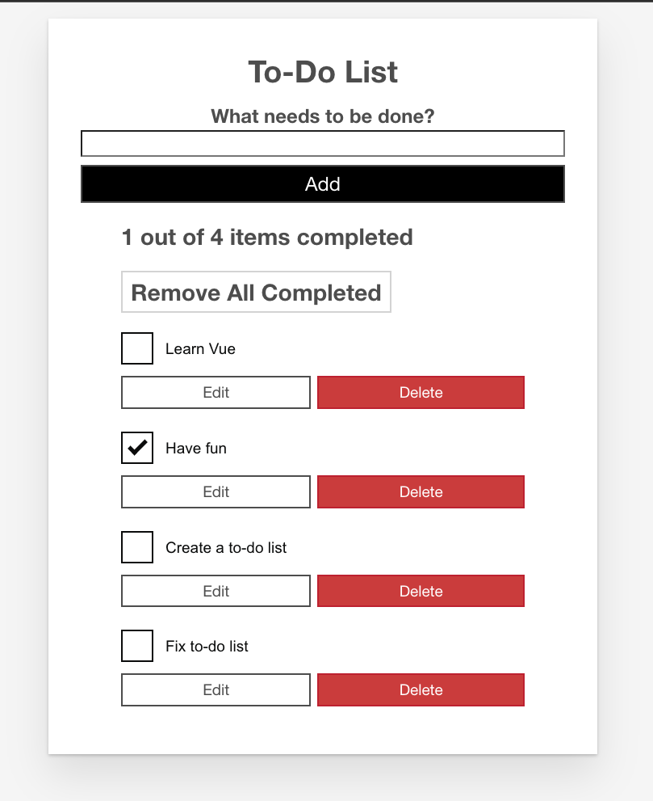
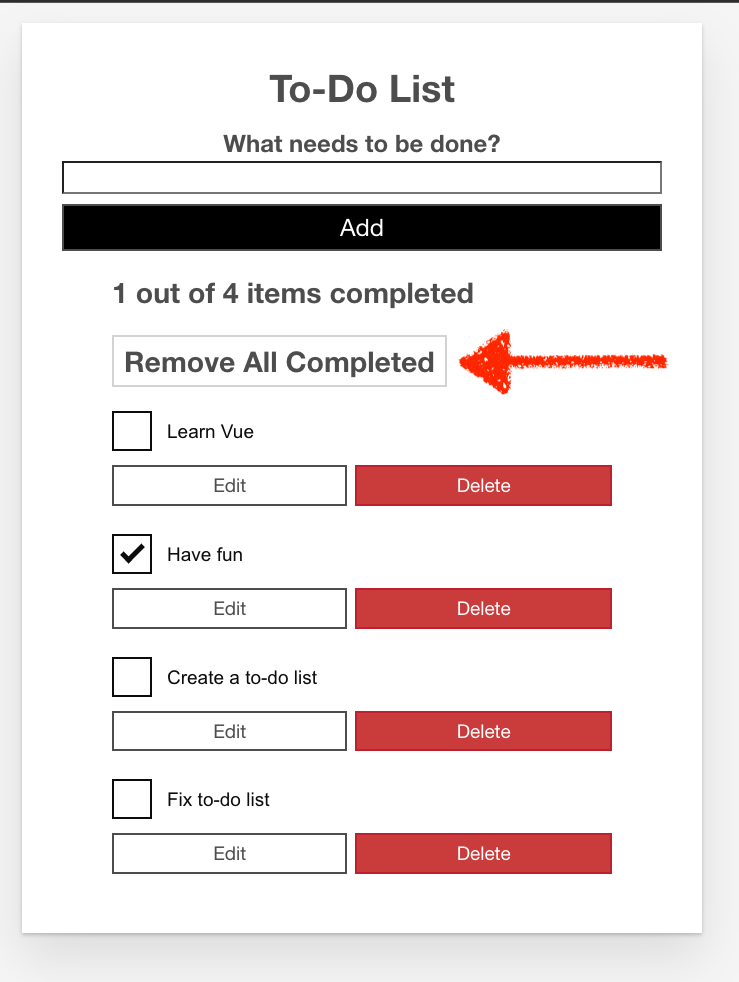

# Problem 1

## Developer Environment Prerequisite

1. NodeJs
2. Chrome Browser

## Steps to run the Vue Project

1. Go to Desktop and open the Problem 1 Folder in VS Code
2. Launch the VS code app then press **Ctrl+`** to open a terminal.
3. Run `npm install`
4. Run `npm run serve`
5. The above command will open a new tab in the default browser. If not then open the http://localhost:8080/ in the chrome.

_You will see an app like the below screenshot_

## Assessment 1

> Your task is to fix the "Remove All Completed" button. The expected behaviour is that when you click the button, all the todos that are completed should be removed and if there is no todo that is completed then the button should not be enabled.

## Assessment 2

When you write a text into the input and click the "Add" button, the todo should be added to the list.

> Your task is to add the following validations
>
> 1. If the input is empty, then the button should be disabled.
> 2. If there are only whitespaces in the input, then the button should be disabled.
> 3. If the input text is already in the list, then the button should be disabled.

> Bonus: In current implementation, a new task is added at the bottom of the list. You need to add the new task at the top of the list.

_Note: the components are already there. Your task is to provide the data to them and add the missing parts._
